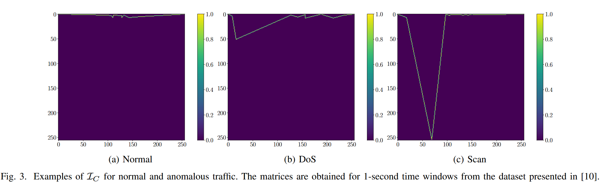

# Unsupervised Network Anomaly Detection with Autoencoders and Traffic Images

## Preprocessed dataset

You can download the used dataset from the following Google Drive [link](https://drive.google.com/drive/folders/1yN96Jad-bSbUzRPmh6wv8600H4TKf7if?usp=sharing).

## Instructions

Download the preprocessed dataset (UGR'16) and then run the script Train_test.py make sure to adjust the dataset path.

